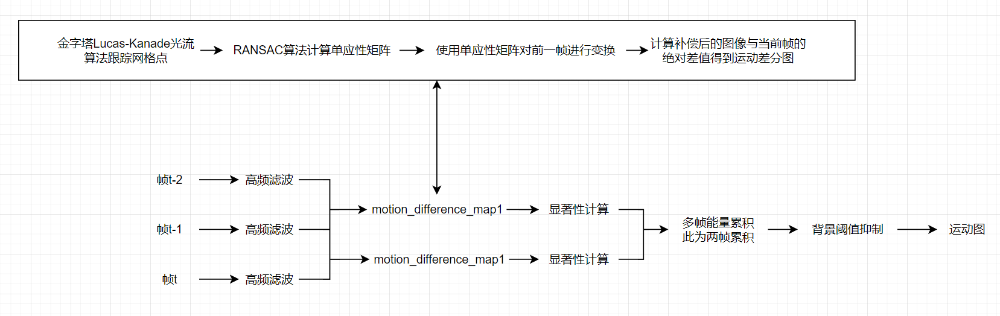
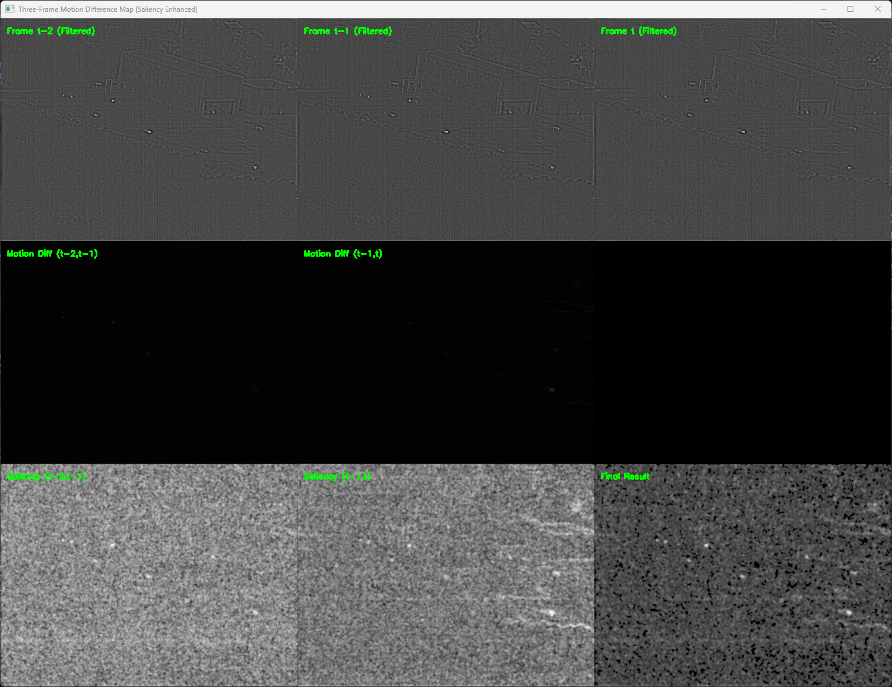

# multi-frame-motion-map-prior
The purpose of this project is to visually demonstrate the target motion modeling in multi frame situations in small object detection, providing prior motion heatmap output. The model structure is as follows:

The sample output is as follows:
